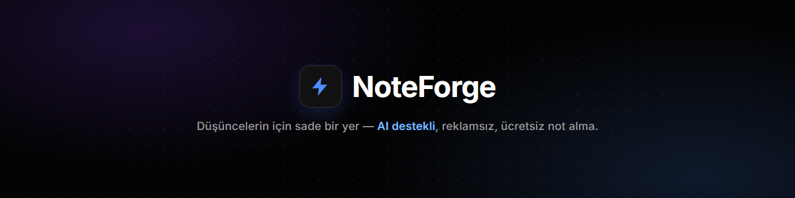
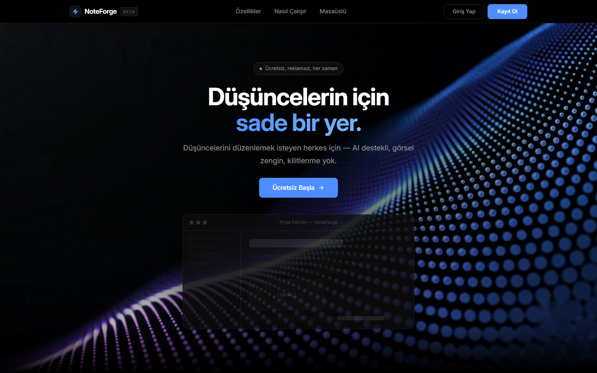
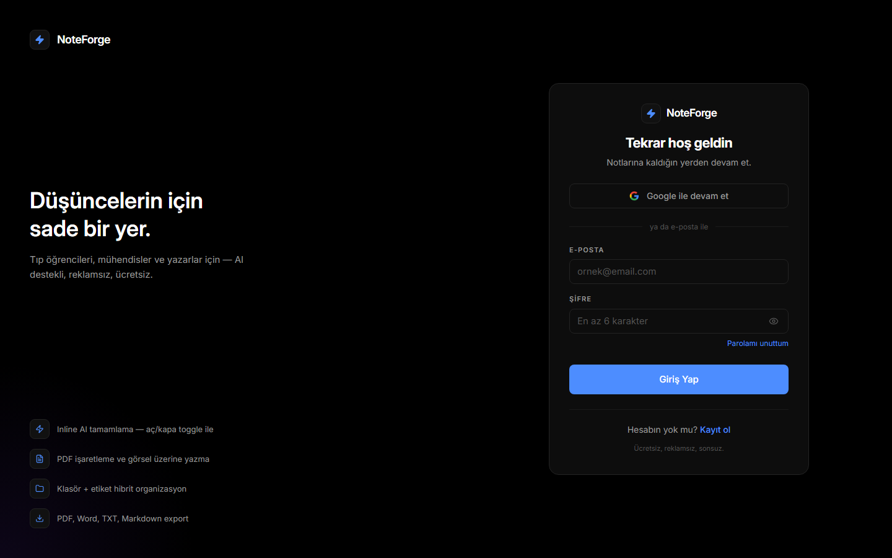

<div align="center">



<br />

**Sade, hızlı ve modern bir not alma uygulaması**


<br />

🚀 **Live Demo: noteforge42.vercel.app](https://noteforge42.vercel.app/)**

<br />

[](https://react.dev)
[](https://www.typescriptlang.org)
[](https://vite.dev)
[](https://tailwindcss.com)
[](https://supabase.com)
[](https://tiptap.dev)
[](https://noteforge42.vercel.app/)

[Canlı Demo](https://noteforge42.vercel.app/) · [Özellikler](#-özellikler) · [Ekran görüntüleri](#-ekran-görüntüleri) · [Teknoloji yığını](#-teknoloji-yığını) · [Kurulum](#-kurulum) · [Veritabanı şeması](#-veritabanı-şeması) · [Yol haritası](#-yol-haritası)

</div>

<br />

## Nedir bu?

NoteForge, dikkat dağıtmayan bir arayüzde zengin metin düzenleme, klasör/etiket
organizasyonu ve çoklu formatta dışa aktarım sunan tam yığın bir not alma SaaS'ıdır. Tamamı React 19 + TypeScript
üzerinde, arka uç olarak Supabase (Postgres + Auth + Storage) kullanılarak
geliştirildi.

Proje kasıtlı olarak **tek bir tasarım diline** sadık kalır: koyu tema, sabit
260px sidebar, 720px okunabilir içerik genişliği — Notion, Bear ve Craft'tan
ilham alan bir düzen.

<br />

## ✨ Özellikler

### 📝 Editör
TipTap (ProseMirror) üzerine kurulu zengin metin editörü:
- **Biçimlendirme:** kalın, italik, üstü çizili, H1–H3, madde/numaralı liste,
  girinti, alıntı, satır içi kod, kod bloğu, yatay çizgi
- **Klavye kısayolları:** `Ctrl/Cmd+B`, `Ctrl/Cmd+I`, `Ctrl/Cmd+Z`/`Y`,
  `Ctrl/Cmd+S` (hemen kaydet), başlıkta `Enter` → içeriğe geçiş
- **Otomatik kayıt:** yazma durduktan ~1.5 sn sonra debounce ile kaydeder;
  durum göstergesi *Kaydedilmedi → Kaydediliyor → Kaydedildi* olarak güncellenir
- **Görsel canvas:** notun içine sürükle-bırak veya panodan yapıştırarak görsel
  ekle; her görsel bağımsız olarak taşınabilir ve yeniden boyutlandırılabilir
- **Salt-okunur önizleme modu** ve **geri al / yinele** geçmişi

### 🗂️ Organizasyon
- İç içe **klasörler** ve çapraz kategorize eden **etiketler**
- Global tam metin arama (`Ctrl/Cmd+K`) — başlık ve içerikte anlık arama
- Liste / grid görünüm geçişi, klasöre taşıma, çoklu filtre

### 📤 Dışa aktarım
Tek tıkla **PDF**, **Word (.docx)**, **Markdown (.md)** ve **düz metin (.txt)**
— tamamı istemci tarafında, sunucu round-trip'i olmadan (`docx` npm paketi ve
tarayıcının yazdırma motoru ile).

### 🎨 Kişiselleştirme
Ayarlar sayfasından: yazı tipi ailesi, boyutu, satır aralığı, sayfa genişliği
(dar/orta/tam), editör teması (koyu/açık/sepia — yalnızca editör yüzeyini
etkiler, uygulama kabuğu koyu kalır) ve dil (TR/EN).

### 📱 Duyarlı tasarım
768px altında sidebar bir **drawer**'a dönüşür (gövde kaydırma kilidi,
arka plan perdesi, `Esc` ile kapanma); toolbar dar ekranlarda yatay kayar ve
kenar solması ile devamı olduğunu gösterir.

### 🔐 Kimlik doğrulama & veri
Supabase Auth ile e-posta/şifre ve Google OAuth girişi, satır seviyesi
güvenlik (RLS) politikalarıyla korunan Postgres tabloları, Supabase Storage'da
tutulan görseller.

<br />

## 📸 Ekran görüntüleri

<table>
<tr>
<td width="50%">

**Açılış sayfası**


</td>
<td width="50%">

**Giriş ekranı**


</td>
</tr>
</table>

<!--
  Not editörü, not listesi ve ayarlar ekran görüntüleri kimlik doğrulama
  gerektirdiği için buraya eklenecek: docs/screenshots/{editor,note-list,settings}.png
-->

<br />

## 🧱 Teknoloji yığını

| Katman | Teknoloji |
| --- | --- |
| **Framework** | React 19, TypeScript 6, React Router 7 |
| **Build / Dev sunucu** | Vite 8, `@vitejs/plugin-react` |
| **Stil** | Tailwind CSS 4 (`@tailwindcss/vite`), CSS custom properties ile tema token'ları |
| **Zengin metin editörü** | TipTap 3 / ProseMirror (`starter-kit`, `extensions`) |
| **Durum yönetimi** | Zustand (auth & arama store'ları) |
| **Backend / BaaS** | Supabase — Postgres, Auth (e-posta + Google OAuth), Storage, Row Level Security |
| **Dışa aktarım** | `docx` (Word üretimi), özel TipTap-JSON → Markdown dönüştürücü, `window.print()` (PDF) |
| **İkonlar** | lucide-react |
| **Lint** | oxlint |
| **Dağıtım** | Vercel (SPA rewrite ile) |

<br />

## 📂 Proje yapısı

```
src/
├── components/
│   ├── editor/     # TipTap sarmalayıcı, görsel canvas
│   ├── layout/     # Sidebar, route koruması
│   └── ui/         # Button, Card, Input, Modal, arama paneli…
├── features/
│   ├── auth/       # Giriş/kayıt sayfası + Supabase auth servisi
│   ├── notes/      # Not/klasör/etiket CRUD servisleri, editör & liste sayfaları
│   └── settings/   # Kullanıcı tercihleri servisi
├── hooks/          # useAuth, useDebounce, useApplyPreferences, useOverflowAffordance
├── lib/            # supabase client, aiService, exportNote, i18n, utils
├── pages/          # LandingPage, SettingsPage
├── store/          # Zustand store'ları (auth, arama)
└── types/          # Supabase şemasını yansıtan TS tipleri

supabase/
└── migrations/          # 001–005: şema, RLS politikaları, arama, storage, tercihler
```

<br />

## 🚀 Kurulum

### Gereksinimler
- Node.js 20+
- Bir [Supabase](https://supabase.com) projesi

### Adımlar

```bash
git clone https://github.com/musabarutcu/noteforge.git
cd noteforge
npm install
cp .env.example .env.local   # aşağıdaki değerleri doldur
npm run dev
```

Uygulama `http://localhost:5173` üzerinde açılır.

### Veritabanı

`supabase/migrations/` altındaki 5 dosyayı, Supabase Dashboard → **SQL Editor**
üzerinden sırayla çalıştır (ya da Supabase CLI ile `supabase db push`):

| # | Migration | İçerik |
| --- | --- | --- |
| 001 | `initial_schema.sql` | `profiles`, `folders`, `notes`, `tags`, `notes_tags`, `media_assets`, `user_preferences` tabloları |
| 002 | `rls_policies.sql` | Tüm tablolarda satır seviyesi güvenlik — kullanıcılar yalnızca kendi verisini görür |
| 003 | `fix_search_vector.sql` | Tam metin arama dilini bölgesel uyumluluk için `simple`'a sabitler |
| 004 | `storage_and_media_assets.sql` | `note-images` storage bucket'ı ve erişim politikaları |
| 005 | `user_preferences_ext.sql` | Dil ve bildirim tercihi sütunları |

### Ortam değişkenleri

| Değişken | Zorunlu | Açıklama |
| --- | --- | --- |
| `VITE_SUPABASE_URL` | ✅ | Supabase proje URL'i |
| `VITE_SUPABASE_ANON_KEY` | ✅ | Supabase anon (public) anahtarı |

### Komutlar

| Komut | Açıklama |
| --- | --- |
| `npm run dev` | Geliştirme sunucusunu başlatır (HMR) |
| `npm run build` | Tip kontrolü (`tsc -b`) + üretim derlemesi (`vite build`) |
| `npm run preview` | Üretim derlemesini yerelde önizler |
| `npm run lint` | `oxlint` ile statik analiz |

<br />

## 🗄️ Veritabanı şeması

```
profiles ──┐
           │
folders ◄──┼── notes ──┬── notes_tags ──► tags
  │        │           │
  └── (self, parent_id) └── media_assets (Storage: note-images bucket)

user_preferences (1:1 → auth.users)
```

- `notes.content_json` — TipTap'in `JSONContent` ağacı (kaynak format)
- `notes.content_markdown` — arama ve dışa aktarım için türetilmiş düz metin
- Tüm tablolarda RLS aktif; her sorgu oturum sahibinin `user_id`'siyle sınırlı

<br />

## ☁️ Dağıtım

Proje Vercel için hazır (`vercel.json` SPA rewrite kuralı içerir — istemci
tarafı routing'in derin linklerde 404 vermemesi için). Vercel dashboard'unda
projeyi bağla, ortam değişkenlerini gir, `npm run build` otomatik çalışır.

<br />

## 🛣️ Yol haritası

- [ ] PDF içe aktarma + üzerine işaretleme (veritabanı şeması hazır,
      arayüz henüz yok)
- [ ] Offline destekli masaüstü uygulaması
- [ ] `.pdf` dışa aktarımı için popup-print yerine gerçek PDF üretimi

<br />

## 📄 Lisans

Bu depo için henüz bir lisans dosyası belirlenmedi (`package.json` içinde
`"private": true`). Açık kaynak olarak paylaşmadan önce bir `LICENSE` dosyası
eklenmeli.

